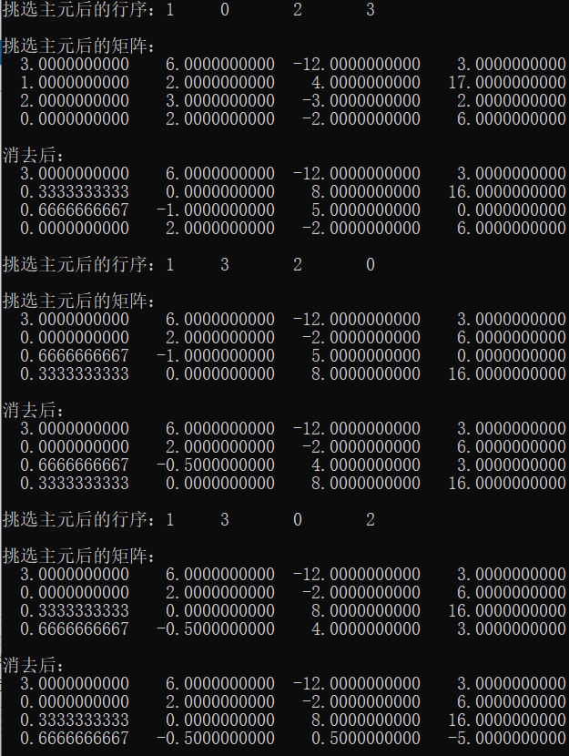
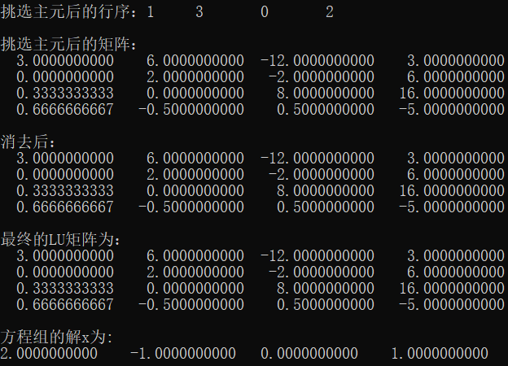

### 编程作业PA=LU分解程序注释和说明

**纯C++语言编写**

```c++
#include <iostream>
#include <iomanip>
#include <math.h>
using namespace std;
const int n = 4;

void PA_LU(double a[n][n], double b[n], double x[n]) {
    // PA = LU 分解函数
    int p[n]; for (int i = 0; i < n; i++) p[i] = i; // 数组p 用于记录行位置变换
    for (int pivot = 0; pivot < n; pivot++) {
        // 第 pivot 次选主元（即第 pivot 列的主元）
        int col = pivot;
        int max_row = p[pivot];
        double max_val = 0;

        for (int i = pivot; i < n; i++) {
            int row = p[i];
            if (fabs(a[row][col]) > max_val) { // 绝对值最大的那个挑选为主元
                max_val = fabs(a[row][col]);
                max_row = i;// 记录下标, 之后 p[i] 将会与 p[pivot] 交换
            }
        }

        // 行变换记录到数组 p 中
        if (max_row != p[pivot]){
            int tmp = p[pivot]; 
            p[pivot] = p[max_row];
            p[max_row] = tmp;  
        }

        cout << "挑选主元后的行序：";
        for (int x : p)cout << x << "\t";
        cout << endl << endl << "挑选主元后的矩阵：" << endl;
        // 选取主元并执行消去过程
        for (int i = 0; i < n; i++){
            for (int j = 0; j < n; j++)
                cout << setw(14) << fixed << setprecision(10) << a[p[i]][j] << "\t";
            cout << endl;
        }
        cout << endl;

        // 开始消去
        int p_row = p[pivot];//主元所在行
        int p_col = pivot; // 主元所在列

        for (int i = pivot + 1; i < n; i++) {
            int row = p[i];
            double  s = a[row][p_col] / a[p_row][p_col];
            for (int col = pivot+1; col < n; col++)
                a[row][col] -= a[p_row][col] * s; // 这是上三角行列
            a[row][p_col] = s;                    // 这是下三角行列
        }

        cout << "消去后：" << endl;
        // 执行消去后
        for (int i = 0; i < n; i++){
            for (int j = 0; j < n; j++)
                cout << setw(14) << fixed << setprecision(10) << a[p[i]][j] << "\t";
            cout << endl;
        }
        cout << endl;
    }
    
    // 消去后的LU矩阵
    cout << "最终的LU矩阵为：" << endl;
    for (int i = 0; i < n; i++){
        for (int j = 0; j < n; j++)
            cout << setw(14) << fixed << setprecision(10) << a[p[i]][j] << "\t";
        cout << endl;
    }
    cout << endl;
    
    // 求解 Ly=b 
    double y[n] = { 0,0,0,0 };
    for (int i = 0; i < n; i++){
        int row = p[i];
        for (int col = 0; col < i; col++)
            b[row] -= a[row][col] * y[p[col]];
        y[row] = b[row];
    }

    // 求解 Ux=y 
    for (int i = n - 1; i >= 0; i--){
        int row = p[i];
        for (int col = n - 1; col >= i + 1; col--)
            y[row] -= a[row][col] * x[col];
        x[i] = y[row] / a[row][i];
    }
}

int main(){
    double A[n][n] = { {1,2,4,17},{3,6,-12,3},{2,3,-3,2},{0,2,-2,6} };
    double b[n] = { 17,3,3,4 };
    double x[n] = { 0,0,0,0 };
    PA_LU(A, b, x);
    // setw 共占的空格数目
    // fixed：用普通方式输出浮点数, 而不是科学计数法;
    // setprecision：出现在小数点后的位数
    cout << "方程组的解x为:" << endl;
    for (int i = 0; i < n; i++)
        cout << setw(12) << fixed << setprecision(10) << x[i] << "\t";
    cout << endl;
    return 0;
}
```

本程序可以给出矩阵的 **PA=LU** 分解以及分解过程，其中 **P** 矩阵记录在行变换数组 **p** 中，**L** 矩阵和 **U** 矩阵合在一块记录，下三角为 **L**，对角线与上三角为 **U**（和课件中形式一致），之后求解 **Ly=b** 和 **Ux=y** 最终得到原方程的解。

作业题分解示例：





